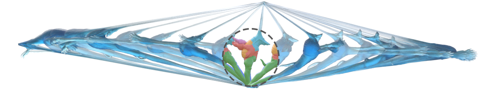

# DOT
Decomposed Optimization Time Integration (DOT) is a domain-decomposed optimization method for fast, reliable simulation of deformation dynamics. DOT efficiently converges with frame-rate time-steps across a wide range of extreme conditions.

<http://dannykaufman.io/projects/DOT/DOT.html>

## Clone Repository
```
git clone https://github.com/liminchen/DOT
```
Then in DOT folder there will be
* src/: source code including DOT and our implementation on a set of alternative methods including [PN](https://www.math.ucla.edu/~jteran/papers/TSIF05.pdf), LBFGS-H(I), LBFGS-JH, [LBFGS-PD](http://tiantianliu.cn/papers/liu17quasi/liu17quasi.html), [ADMM-PD](https://mattoverby.net/pages/admmpd_abstract.html), ADMM-DD, GSDD (see method description in Script Settings section below), supporting both [Fixed CoRotational](https://www.math.ucla.edu/~jteran/papers/SHST12.pdf) and [Stable Neo-Hookean](https://graphics.pixar.com/library/StableElasticity/paper.pdf) elasticity. The code has been cleaned up with small bug fixes after the paper.
* SuiteSparse/, libigl/, and ext/tbb/(auto-download): external libraries, i.e. [SuiteSparse 5.3.0](http://faculty.cse.tamu.edu/davis/suitesparse.html), [libigl](https://libigl.github.io/) (an older version, with [Eigen](http://eigen.tuxfamily.org/), [OpenGL](https://www.opengl.org/), [GLFW](https://www.glfw.org/), [libpng](http://www.libpng.org/pub/png/libpng.html), [Triangle](https://www.cs.cmu.edu/~quake/triangle.html), and [Tetgen](http://wias-berlin.de/software/tetgen/)), and [Intel TBB](https://software.intel.com/en-us/intel-tbb)
* install_Ubuntu.py: a python script to automatically rebuild SuiteSparse on Ubuntu (requires MKL) and build DOT
* install_Mac.py: a python script to automatically rebuild SuiteSparse on Mac and build DOT
* build.py: a python script to automatically build DOT with default compiler
* batch.py: a python script to automatically run a batch of examples with specified number of threads for each linear solver in the program (see details below)
* input/: input meshes and DOT scripts for all the examples shown in the paper organized by table, we also provide examplar scripts to run alternative methods under input/otherMethods
* output/: output data (will be created)
* cmake/ and CMakeLists.txt: CMake files

## Compile and Run
* Install (rebuild Suitesparse and DOT)

On Ubuntu:
```
cd DOT
python install_Ubuntu.py
```
On Mac:
```
cd DOT
python install_Mac.py
```
This will rebuild SuiteSparse (with MKL on Ubuntu or default on Mac) and then build DOT.

*Tips on linear solver: By default DOT uses CHOLMOD (involved in SuiteSparse) to solve the linear systems. On Mac, default compilation is great, but on Ubuntu, we found that CHOLMOD compiled with MKL LAPACK and BLAS is much more performant than compiled with libopenblas and liblapack from apt-get.*

*Note: Prompts and sudo password might be needed to install certain packages.*

*Tips for Windows users: Running DOT on Windows is possible to encounter severe speed issues, which can be related to the memory management of Eigen backend. A useful suggestion is to swap out Eigen's malloc with dlmalloc.*

* Build (rebuild DOT)
```
python build.py
```

* Run

We provide a convenient way to run a batch of examples with a specific number of threads per linear solver using the batch.py under repo directory.

To use batch.py, first create 4 folders named 1, 8, 12, and 32 under input/, which means use these numbers to set MKL_NUM_THREADS, OMP_NUM_THREADS, VECLIB_MAXIMUM_THREADS respectively for the linear solvers when running examples under them. (This will not affect the parallelization of other parts of DOT as we are using TBB there). Then you can put the script files to be run under folder 1, 8, 12, or 32 and go to DOT/ to run
```
python batch.py
```
The python code will automatically take the name of the folder to set number of threads per linear solver to run the examples. In our experiments we ran PN, LBFGS-H(I), and GSDD with 12 threads per linear solver and all others with single thread per linear solver since for the latter ones we solve multiple linear systems simultaneously with TBB and we were on a 6-core 12-thread machine.

The output of each script will be saved into a separate folder in output/ with time tag, so no overwrites when reruning.

*Note that by default we only compile 3D version of DOT, to compile and run the 2D version, please modify the DIM macro defined in src/Utils/Types.hpp and rebuild, and then you can run scripts from input/2D/.*

## Output Files
* n.obj: surface mesh of the simulated object in n-th time step
* statusn: saved information of n-th time step that can be used to restart the simulation from
* 0.png and finalResult.png: snapshot of the initial and the last time step
* finalResult_mesh.msh/finalResult_mesh.obj: shape of the simulated object in the last time step
* anim.gif: animation preview of the simulation
* config.txt: the config file containing all simulation settings that can be used to rerun the simulation
* iterStats.txt: simulation/optimization statistics of each iteration
* info.txt: timing information
* log.txt: debug information
* label.obj: subdomain label of each vertex on the input shape (DOT output only)
* wire.poly: wire frame of the mesh in rest shape (DOT output only)

## Command Line Arguments
Format: progName mode inputScriptPath [anyStringYouLike]

Example: ./build/DOT_bin 10 input/bunny5K_LTSS_DOT.txt firstTrial
* progName
  * ./build/DOT_bin
* mode
  * 0: DOT with real-time optimization mode, animation will be visualized per time step, need user to start/restart and pause the process via '/' key
  * 10: DOT with real-time optimization mode, animation will be visualized per time step, the optimization will automatically start at the beginning, user can use '/' key to start/restart and pause the process
  * 11: mode 10 with each time step's screenshot saved in the created output folder
  * 100: DOT with headless mode, no visualization, only command line prints and file output
  * 1: diagnostic mode, for unit test
  * 2: mesh processing mode, for unit test
* inputScriptPath
  * can be either absolute or relative
  * must be .txt
* anyStringYouLike
  * optional, the appended string to the name of a folder to be created for holding all output files

## Script Settings
* `energy {FCR | SNH}`
    * `FCR`: Fixed Co-rotational elasticity energy
    * `SNH`: Stable Neo-Hookean elasticity energy
* `timeIntegration {BE}`
    * `BE`: Backward Euler (default)
* `timeStepper { Newton | LBFGSH | LBFGSHI | LBFGS | ADMM <number-of-iterations> | DOT {<number-of-subdomains> | -1 <nodes-per-block>} | ADMMDD {<number-of-subdomains> | -1 <nodes-per-block>} | LBFGSJH {<number-of-subdomains> | -1 <nodes-per-block>} | GSDD {<number-of-subdomains> | -1 <nodes-per-block>}}`
    * `Newton`: projected Newton
    * `LBFGSH`: LBFGS-H
    * `LBFGSHI`: LBFGS with incomplete Cholesky decomposition of the beginning of time step Hessian as initializer
    * `LBFGS`: LBFGS-PD
    * `ADMM`: ADMM-PD
    * `DOT`: our method
    * `ADMMDD`: [must be used without SIMD] a constrained formulation of domain decomposed elastodynamic simulation realized by ADMM. This is our initial trial. It is robust but slow to converge.
    * `LBFGSJH`: LBFGS initialized with Jacobi domain decomposition (nonoverlapped block diagonal preconditioning)
    * `GSDD`: Gauss-Seidel domain decomposition (sequential overlapped block diagonal preconditioned gradient descent)
* `warmStart {0-5}`
    * `0`: initial position (no warm start) (xⁿ)
    * `1`: initial position + integrated velocity (xⁿ + Δt vⁿ), the one we found provides the fastest convergence but with a little bit damping if not solving to enough accuracy (1e-5 CN that we used in all of our experiments is accurate enough)
    * `2`: initial position + integrated velocity + doubly integrated gravity (xⁿ + Δt vⁿ + Δt² g), the one used in all of our experiments
    * `3`: uniformly accelerated warm start
    * `4`: symplectic Euler warm start
    * `5`: Jacobi warm start
* `resolution <num-elements>`
    * number of elements (:warning:not working for tetrahedral meshes:warning:)
* `size <size>`
    * size of the bounding box in meters
* `time <num-seconds> <time-step>`
    * total time in seconds
    * Δt in seconds
* `density <density>`
    * density of the mesh in Kg/m³
* `stiffness <young-modulus> <poisson-ratio>`
    * Young's modulus (E) in Pa
    * Poisson's ratio (ν)
* `turnOffGravity`
    * no gravity if specified
* `script {null | scaleF | hang | stretch | squash | stretchnsquash | bend | twist | twistnstretch | twistnsns | twistnsns_old | rubberBandPull | onepoint | random | fall}`
    * Different animation scripts (see `src/AnimScripter.cpp` for details)
* `handleRatio <ratio>`
    * the proportion of fixed vertices for setting Dirichlet boundary conditions
    * `ratio` must be greater than zero and less than one
* `shape input <mesh-file-path>`
* `rotateModel <rot-axis-x> <rot-axis-y> <rot-axis-z> <rot-deg>`
    * rotate model in model space with rotDeg degrees along direction `[rot-axis-x rot-axis-y rot-axis-z]`
* `tol positiveInteger`
    * number of time steps to set for CN followed by that number of positiveRealNumber
    * if not set, all time steps will use 1e-5 CN
    * if set and more than positiveInteger time steps will be simulated, the exceeding time steps will use the last tolerance set by this command
* `restart <status-file-path-str>`
    * restart simulation from the time step in the specified status file (other settings must be the same)
* `view {orthographic | perspective}`
* `zoom <positive-real-number>`
* `appendStr <str>`
    * append result folder with the string specified
* `disableCout`
    * no command line output if specified